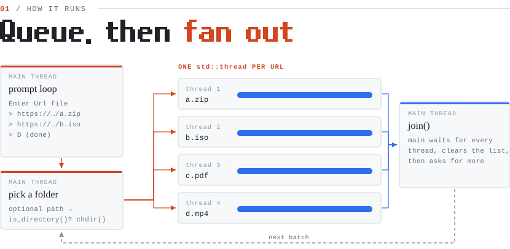
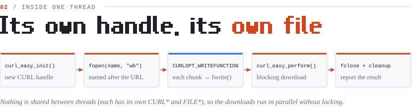

<picture>
  <source media="(prefers-color-scheme: dark)" srcset="docs/banner-dark.svg" />
  
</picture>

Built a multi-threaded C++ file downloader using libcurl to manage parallel downloads efficiently, ensuring data integrity with mutex synchronization and supporting custom download paths.

<picture>
  <source media="(prefers-color-scheme: dark)" srcset="docs/flow-dark.svg" />
  
</picture>

<picture>
  <source media="(prefers-color-scheme: dark)" srcset="docs/thread-dark.svg" />
  
</picture>

## Run it

```bash
make                      # needs libcurl (e.g. apt install libcurl4-openssl-dev)
./monazil_almilafat
# paste URLs one per line, type D when done, then pick a folder (or press Enter)
```

<sub>Diagrams in <code>docs/</code> are generated SVGs, drawn to match the code in this repo.</sub>
